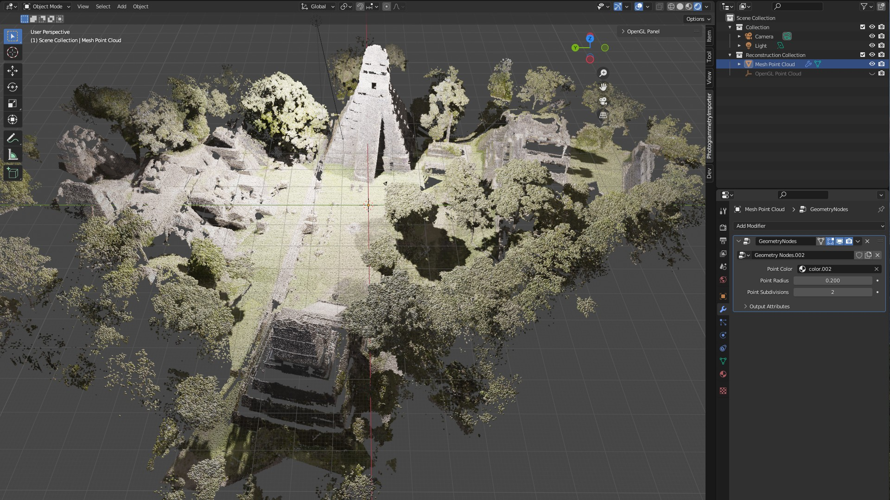
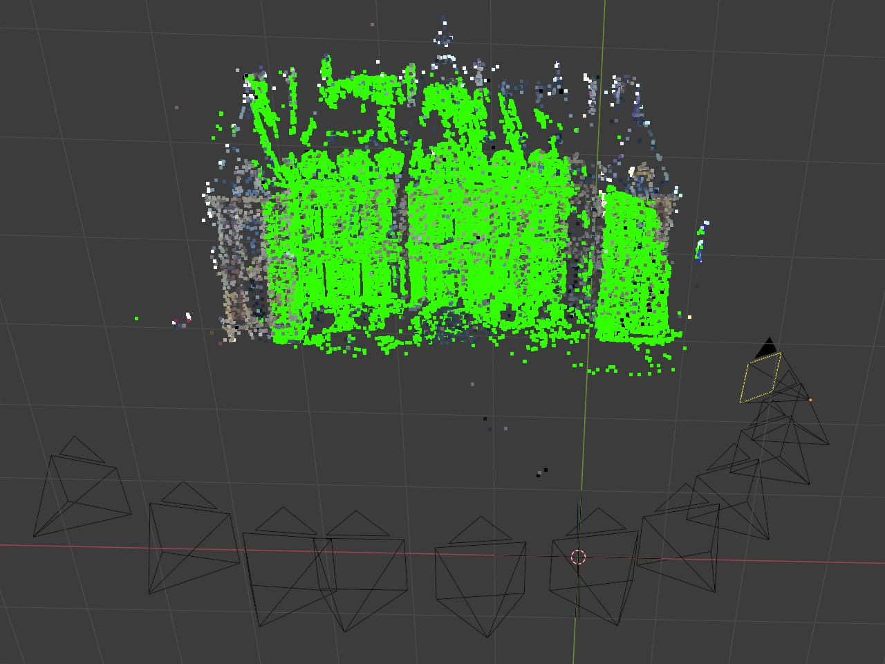
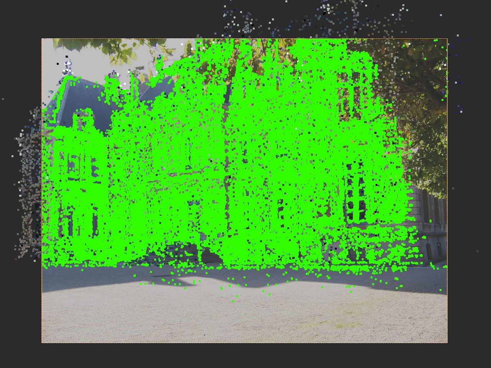

# Blender Photogrammetry Importer
This repository contains a Blender addon to import reconstruction results of several libraries.

## Compatibility

The latest release of the addon is currently compatible with **Blender 3.1.2 onwards**. For older Blender versions you might find a suitable release [here](https://github.com/SBCV/Blender-Addon-Photogrammetry-Importer/releases). 

## Supported Reconstruction Libraries and Point Cloud Data Formats

Supported libraries (data formats):

- [x] [Agisoft Metashape](https://www.agisoft.com/) (VisualSfM NVM) <sup>1</sup>
- [x] [Colmap](https://github.com/colmap/colmap) (Model folders (BIN and TXT), dense workspaces, NVM, PLY)  
- [x] [Meshroom](https://alicevision.github.io/) (MG, JSON, SfM, PLY)
- [x] [MVE](https://github.com/simonfuhrmann/mve) (Workspaces) <sup>1</sup>
- [x] [Open3D](http://www.open3d.org/) (JSON, LOG, PLY) <sup>1</sup>
- [x] [OpenSfM](https://github.com/mapillary/OpenSfM) (JSON)
- [x] [OpenMVG](https://github.com/openMVG/openMVG) (JSON, NVM, PLY)
- [x] [Regard3D](https://www.regard3d.org/) (OpenMVG JSON)
- [x] [VisualSFM](http://ccwu.me/vsfm/) (NVM) <sup>1</sup>

In addition, the addon supports some common point cloud data formats:

- [x] [Polygon files](http://paulbourke.net/dataformats/ply/) (PLY) <sup>2</sup>
- [x] [Point Cloud Library files](https://github.com/PointCloudLibrary/pcl) (PCD) <sup>2</sup>
- [x] [LASer files](https://www.asprs.org/divisions-committees/lidar-division/laser-las-file-format-exchange-activities) (LAS) <sup>2,3</sup>
- [x] [LASzip files](https://laszip.org/) (LAZ) <sup>2,3,4</sup>
- [x] [Simple ASCII point files](https://www.cloudcompare.org/doc/wiki/index.php?title=FILE_I/O) (ASC, PTS, CSV) <sup>2</sup>

<sup>1</sup> Requires [Pillow](https://pypi.org/project/Pillow/) to read image sizes from disk.
<sup>2</sup> Requires [Pyntcloud](https://pypi.org/project/pyntcloud/) for parsing.
<sup>3</sup> Requires [Laspy](https://pypi.org/project/laspy/) for parsing.
<sup>4</sup> Requires [Lazrs](https://pypi.org/project/lazrs/) for parsing.

## Getting Started
- [Documentation](https://blender-photogrammetry-importer.readthedocs.io/en/latest) 
- [Installation Instructions](https://blender-photogrammetry-importer.readthedocs.io/en/latest/installation.html)
- [Troubleshooting](https://blender-photogrammetry-importer.readthedocs.io/en/latest/troubleshooting.html)
- [Customize Import/Export Options](https://blender-photogrammetry-importer.readthedocs.io/en/latest/customize.html)
- [Examples](https://blender-photogrammetry-importer.readthedocs.io/en/latest/examples.html)
- [Import Data](https://blender-photogrammetry-importer.readthedocs.io/en/latest/import.html)
- [Export Data](https://blender-photogrammetry-importer.readthedocs.io/en/latest/export.html)
- [Adjust Results (Scale Cameras and Points)](https://blender-photogrammetry-importer.readthedocs.io/en/latest/adjustment.html)
- [Ensure Camera and Point Alignment](https://blender-photogrammetry-importer.readthedocs.io/en/latest/alignment.html)
- [Point Cloud Visualization and Rendering](https://blender-photogrammetry-importer.readthedocs.io/en/latest/point_cloud.html)
- [Addon Usage with Python](https://blender-photogrammetry-importer.readthedocs.io/en/latest/python.html)
- [Extending the Addon](https://blender-photogrammetry-importer.readthedocs.io/en/latest/extension.html)
- [Contribution](https://blender-photogrammetry-importer.readthedocs.io/en/latest/contribution.html)
- [Recent features / Changelog](https://blender-photogrammetry-importer.readthedocs.io/en/latest/changelog.html)

## Paper
If you use this library for scientific purposes, please consider to cite the following paper.

<a href="https://arxiv.org/pdf/2012.01044.pdf"></a>
<a href="https://doi.org/10.5220/0010319801060112">[paper]</a>&nbsp;&nbsp;<a href="https://arxiv.org/abs/2012.01044">[arxiv]</a><br>
```bibtex
@article{PhotogrammetryForModeling2021,
title={A Photogrammetry-based Framework to Facilitate Image-based Modeling and Automatic Camera Tracking},
author={Bullinger, Sebastian and Bodensteiner, Christoph and Arens, Michael},
booktitle={International Conference on Computer Graphics Theory and Applications},
year={2021}
}
```
<br clear="left"/>

## Example
This repository contains an example Colmap model. The following image shows the imported camera poses, image planes and point cloud in Blender's 3D view.

The input images of the Colmap model are located here: [https://github.com/openMVG/ImageDataset_SceauxCastle](https://github.com/openMVG/ImageDataset_SceauxCastle).

The addon computes an animated camera with corresponding background images from the reconstructed camera poses.


There is also an import option that allows to interpolate the reconstructed camera poses.


In addition, the addon allows to import meshes contained in the workspaces of specific libraries. Manually imported meshes can also be aligned with the corresponding reconstruction by following the instructions [here](https://blender-addon-photogrammetry-importer.readthedocs.io/en/latest/import.html#meshes). 


The addon offers two options to represent the point clouds (OpenGL and Geometry Nodes). The addon provides different panels to adjust the appearance and to render these point clouds - see [Point Cloud Visualization and Rendering](https://blender-addon-photogrammetry-importer.readthedocs.io/en/latest/point_cloud.html). The following images show an example represented with OpenGL (top) and Geometry Nodes (bottom). 




In addition, the addon allows to visualize depth maps (reconstructed with Colmap or MVE) as point clouds.
<p float="left" align="middle">
  
   
</p>
