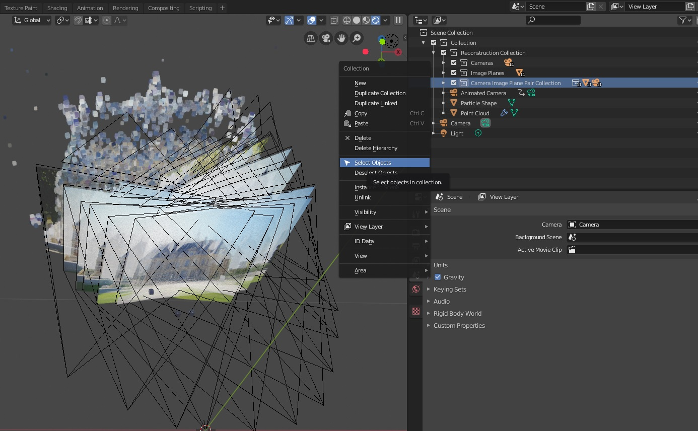
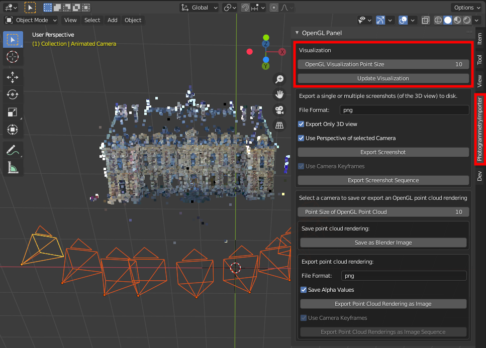
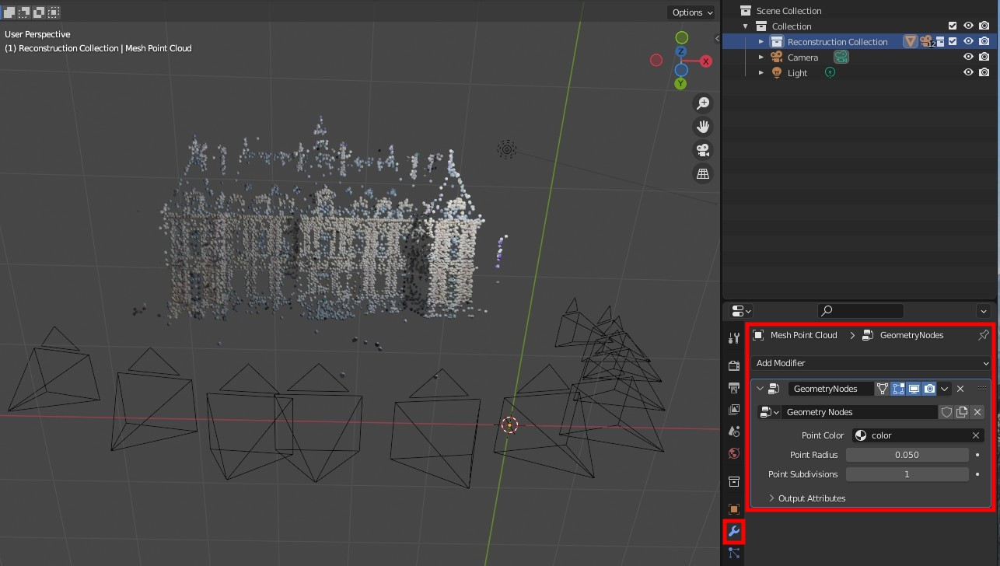

************************
Scale Cameras and Points
************************

Adjust the Scale of Cameras after Importing
===========================================

1.) Select the cameras and the corresponding image planes, i.e. right click on the collection :code:`Camera Image Plane Pair Collection` and in the context menu on :code:`Select Objects`.

2.) Select the individual origins as pivot points, i.e. click in the 3D view on :code:`Pivot Point` and select :code:`Individual Origins`.

.. image:: ../../images/individual_origins_as_pivot_point.jpg
   :scale: 50 %
   :align: center

3.) Scale the objects, i.e. press :code:`s` and move the mouse or press :code:`s` and enter the scaling factor.

.. image:: ../../images/scaled_cameras.jpg
   :scale: 50 %
   :align: center

Adjust the Scale of OpenGL Points Drawn in the 3D View (After Importing)
========================================================================

The size of the points in the OpenGL point cloud can be defined using the panel in the 3D view.

Adjust the Scale/Shape of Geometry Node Points of a Mesh Object (After Importing)
=================================================================================

The input of the Geometry Nodes (i.e. :code:`point radius` and the :code:`point subdivision`) can be adjusted using the :code:`Properties` editor (:code:`Shift + F7`).

