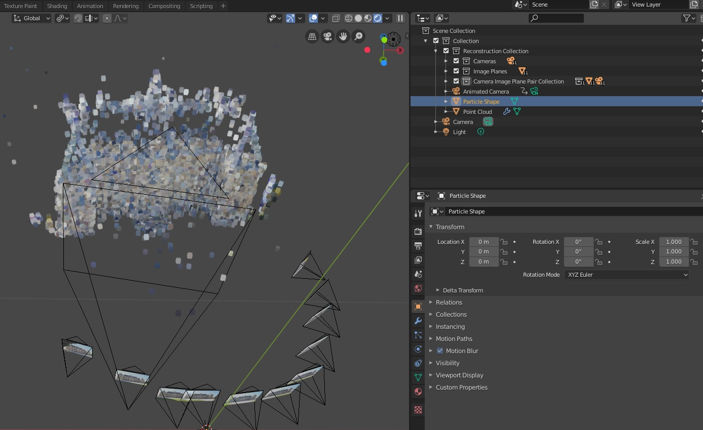
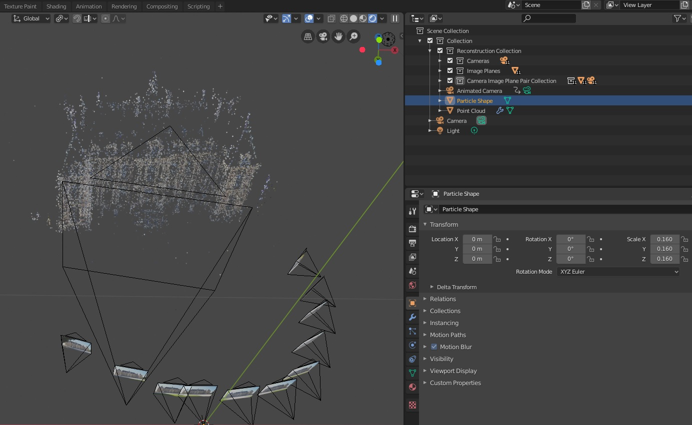

************************
Scale Cameras and Points
************************

Adjust the Scale of Cameras after Importing
===========================================

1.) Select the cameras and the corresponding image planes, i.e. right click on the collection :code:`Camera Image Plane Pair Collection` and in the context menu on :code:`Select Objects`.

.. image:: ../../images/select_cameras_and_image_planes.jpg
   :scale: 50 %
   :align: center

2.) Select the individual origins as pivot points, i.e. click in the 3D view on :code:`Pivot Point` and select :code:`Individual Origins`.

.. image:: ../../images/individual_origins_as_pivot_point.jpg
   :scale: 50 %
   :align: center

3.) Scale the objects, i.e. press :code:`s` and move the mouse or press :code:`s` and enter the scaling factor.

.. image:: ../../images/scaled_cameras.jpg
   :scale: 50 %
   :align: center

Adjust the Scale of Points (Visualized with OpenGL) after Importing
===================================================================

The size of the points in the OpenGL point cloud can be defined using the panel in the 3D view.

.. image:: ../../images/opengl_panel_visualization.png
   :scale: 75 %
   :align: center

Adjust the Scale of Points (Added with a Particle System) after Importing
=========================================================================

For each imported point cloud two objects are created. The first object :code:`Point Cloud` represents the structure of the point cloud and the second object :code:`Particle Shape` defines the shape of the points in the point cloud. 

1.) Select the object :code:`Particle Shape`.

2.) Scale the object, i.e. press :code:`s` and move the mouse or press :code:`s` and enter the scaling factor.

