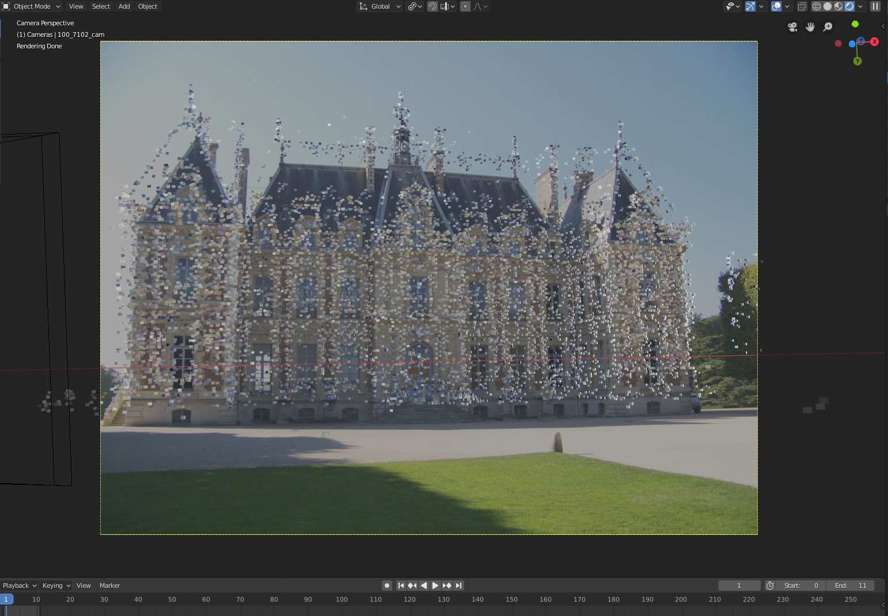
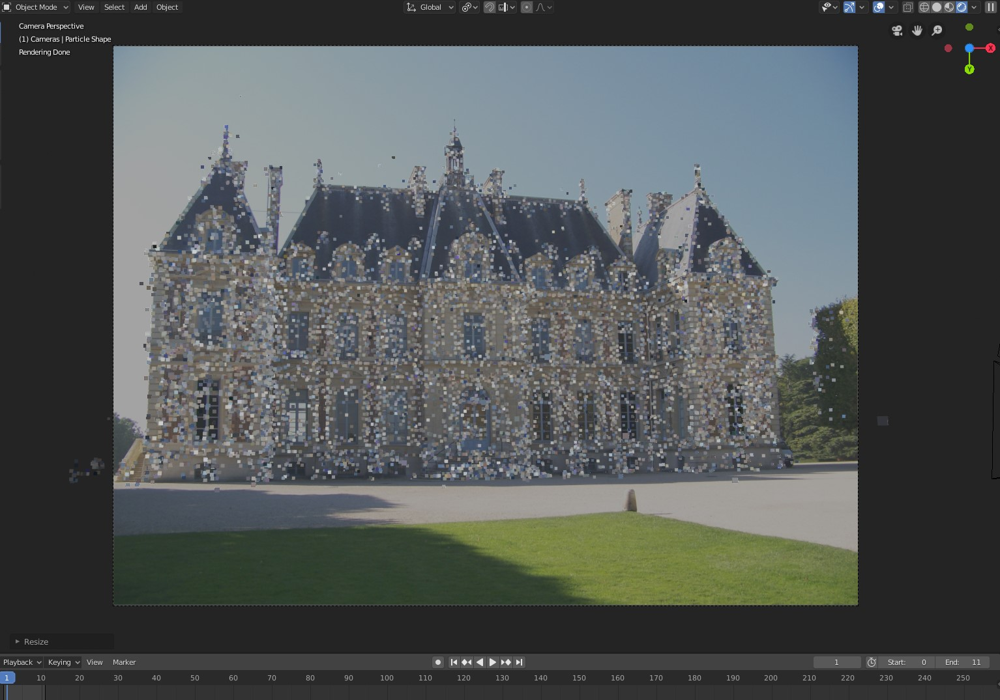
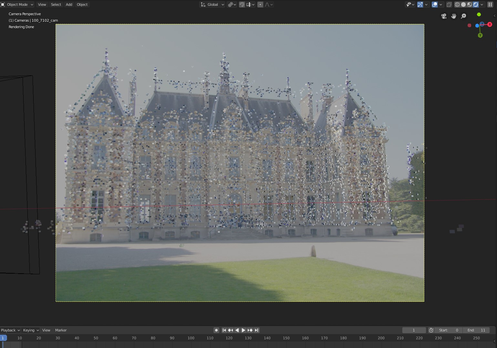

************************************
Alignment of Cameras and Point Cloud
************************************

The 3D viewport of Blender unfortunately does not support radial camera distortions. If the imported Structure from Motion reconstruction has a camera model with radial distortion, the image planes and background images will not perfectly align with the 3D point cloud. For example, such cases occur if the intrinsic camera parameters are optimized (not fixed) during the Structure from Motion reconstruction.
The following image shows a corresponding example. For instance, see the offset between the points at the left and the right side of the building.   

There are two ways to address this issue.

Option 1:
This approach is only applicable, if the images are not subject to radial distortion. Provide the (true) intrinsic camera parameters and fix/lock these during reconstruction. The following image shows the corresponding result. 

Option 2: 
After computing the Structure from Motion reconstruction perform the first step (i.e. image undistortion) of the dense reconstruction (Multi-View Stereo). Using the undistorted images instead of the original imagery resolves the alignment problem. For example, Colmap and Meshroom allow to compute undistorted images. An example is shown below.

