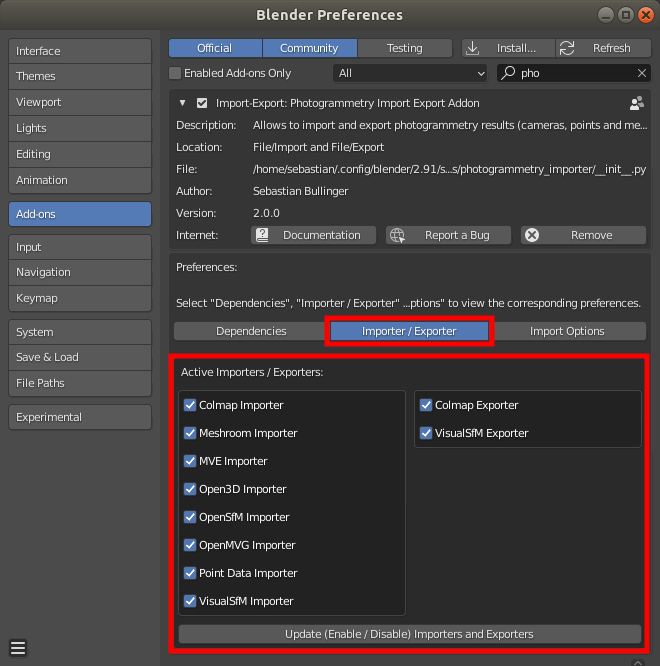
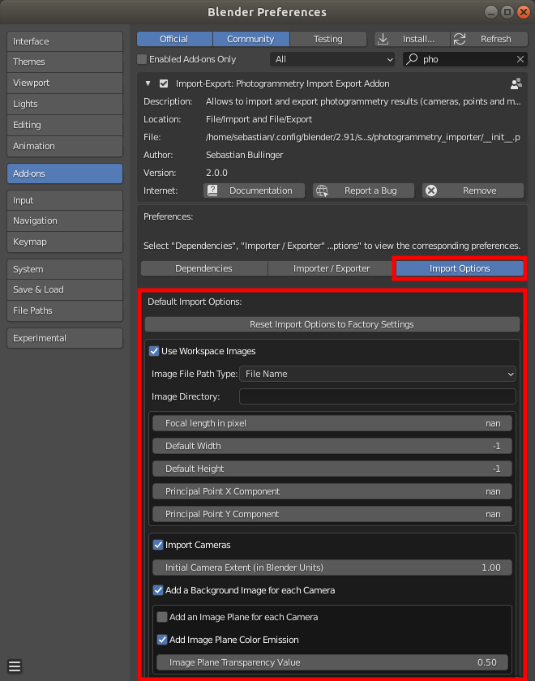

*******************************
Customize Import/Export Options
*******************************

Enable / Disable Importers and Exporters
========================================

If you want to only add a subset of the provided import/export functions, adjust the checkboxes in the `Addon preferences` and click on the :code:`Update (Enable/Disable) Importers and Exporters` button as shown below:

Adjusting Default Import Options
================================

Furthermore, it is possible to set the default import options by adjusting the corresponding settings in the `Addon Preferences` - see the image below.

