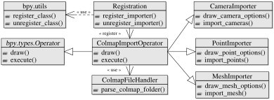

*******************
Extending the Addon
*******************

The addon follows a modular approach to simplify the extensibility of additional libraries.
Each supported library requires the implementation of a corresponding *FileHandler* and *ImportOperator* - see the figure below.
The *FileHandler* parses library specific file formats or directory structures and returns library agnostic information of cameras, points and meshes.
The *ImportOperator* may use different classes provided by the framework (e.g. *CameraImporter*, *PointImporter* and *MeshImporter*) to define the required import options and to import the reconstruction extracted by the *FileHandler*.

   Integration of the addon with Blender - illustrated with the Colmap importer. In order to support additional SfM and MVS libraries it is sufficient to implement the corresponding import operators and file handlers. To simplify the figure only relevant classes and methods are shown.

