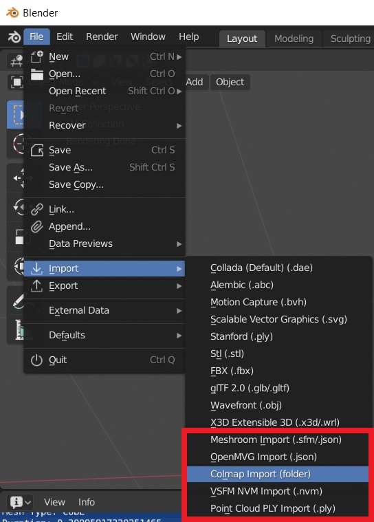

***********
Import Data
***********

**Errors, help and logging information during import / export is shown in the `Info` area. Check this output, if nothing is imported. Probably the default width and height values are not set (see below).**

General
=======
In Blender use :code:`File/Import/<Import Function>` to import the corresponding file.

For each camera one can add the corresponding image plane. Pillow is required to read the images from disc. Use the import dialog to adjust the :code:`image path`. By default the addon searches for the images in the folder where the reconstruction file is located. **This addon uses the node system of Cycles to visualize the image planes. Thus, the addon switches automatically to Cycles, if image planes are added.**

There is an option to represent the point cloud with a particle system. This allows you to render the point cloud. A single texture is used to store the color of all particles. **The color of the points / textures of the images are visible, if "Cycles Render" is selected and the 3D view is set to "Material".** Eevee does not (yet) support :code:`particle info` nodes. (Checkout the `manual <https://docs.blender.org/manual/es/dev/render/eevee/materials/nodes_support.html>`_ for more information.) Thus, it is currently **not possible** to render point clouds with individual particle colors **in Eevee**.

VisualSfM
=========
The addon automatically looks for the fixed calibration line in the NVM file (i.e. :code:`NVM_V3 FixedK fx cx fy cy r`  (first line)).
Without the fixed calibration line the addon assumes that the principal point is at the image center. NVM files contain no information about the size of the images. Use the import dialog to adjust the :code:`image path` to automatically read the image size from disc or set the default :code:`width` and :code:`height` values.

.. role:: strike
    :class: strike

OpenMVG JSON
============
The OpenMVG :code:`JSON` files contain no color information. If you want to import a point cloud with color information, you might want to use the :code:`openMVG_main_ComputeSfM_DataColor` tool (see  `this link <https://openmvg.readthedocs.io/en/latest/software/SfM/ComputeSfM_DataColor/>`_) and import the corresponding :code:`*.ply` file.

Meshroom
========
By default Meshroom stores the Structure from Motion results (i.e. cameras and points) in Alembic (:code:`*.abc`) files. Since parsing :code:`*.abc` files requires building additional (heavy) dependencies, e.g. `this <https://github.com/alembic/alembic>`_ library, it is currently not supported by this addon.
However, one can add a :code:`ConvertSfMFormat` node in Meshroom (see image below) to write the reconstruction result to :code:`*.SfM` / :code:`*.json` files.

.. image:: ../../images/meshroom_export_json.jpg
   :scale: 40 %
   :align: center

In addition to :code:`*.SfM` / :code:`*.json` files the addon allows to import :code:`*.mg` files, which allows to also import corresponding meshes.
The addon prioritizes the output of recently added nodes (e.g. :code:`ConvertSfMFormat3` has a higher priority than :code:`ConvertSfMFormat`).
For importing meshes the addon uses the following prioritization: first the output of :code:`Texturing`, then the output of :code:`Meshfiltering` and finally the output of :code:`Meshing`.
Do not forget to save your project (i.e. the :code:`*.mg` file), since the addon uses this file to determine available reconstruction results.

In order to import the original images corresponding to the :code:`*.mg` file, one can set the import option :code:`Image File Path Type` of the Blender-Addon to :code:`Absolute Path`.
To import the undistorted :code:`*.exr` images set :code:`Image File Path Type` to :code:`File Name` and set :code:`Image Directory` to the folder with the :code:`*.exr` files.

Regard3D
========
By default Regard3D stores the Structure from Motion results in :code:`path/to/project/pictureset_0/matching_0/triangulation_0/sfm_data.bin`. Use `OpenMVG <https://github.com/openMVG/openMVG>`_ to convert the :code:`*.bin` to a :code:`*.json` file with :code:`openMVG_main_ConvertSfM_DataFormat -i path/to/sfm_data.bin -o path/to/cameras.json`. For Windows you can find the pre-built binaries of OpenMVG `here <https://github.com/openMVG/openMVG/releases/>`_.

ASCII
=====
Each line in an ASCII file (:code:`.asc/.pts/.csv`) represents a point with several attributes (coords, normals, colors, ...).
In the case of :code:`.asc/.pts/` there might be an optional header such as :code:`//X Y Z Rf Gf Bf Intensity` or :code:`//X Y Z Intensity R G B` that defines the order of the attributes.
If no header is provided, the addon tries to estimate the order of the attributes.
The color attributes can be defined as integer values (:code:`R G B`) between :code:`0` and :code:`255` or float values (:code:`Rf Gf Bf`) between :code:`0.0` and :code:`1.0`.
Attributes other than position and color are ignored by the addon.

Meshes
======
In order to view a reconstructed mesh with the corresponding sparse reconstruction (cameras and point cloud) import the files separately. When importing :code:`*.obj` files make sure to adjust the corresponding import transform options. Set the :code:`Forward` option to :code:`Y Forward` and the :code:`Up` option to :code:`Z Up`.

Limitations
===========
Blender supports only global render settings (which define the ratio of all cameras). If the reconstruction file contains cameras with different aspect ratios, it is not possible to visualize the camera cones correctly. Furthermore, radial distortions of the camera model used to compute the reconstruction will result in small misalignment of the cameras and the particle system in Blender.
