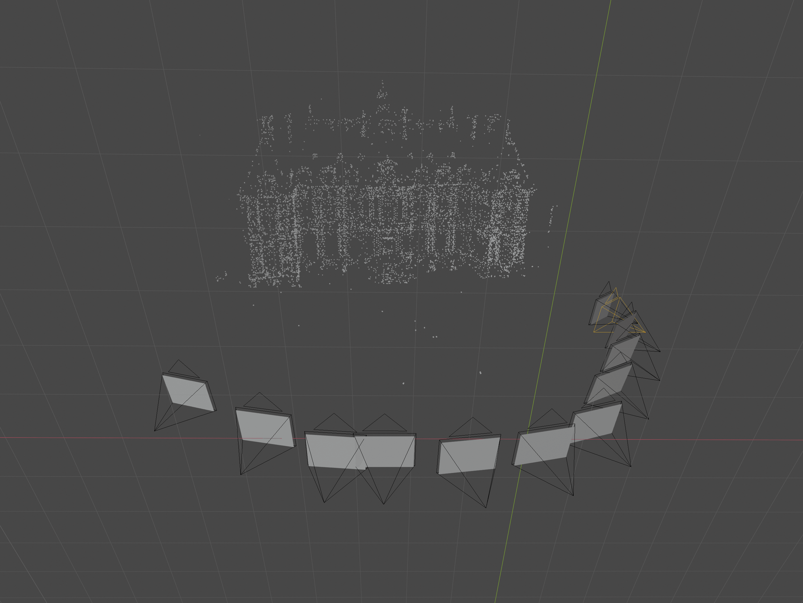
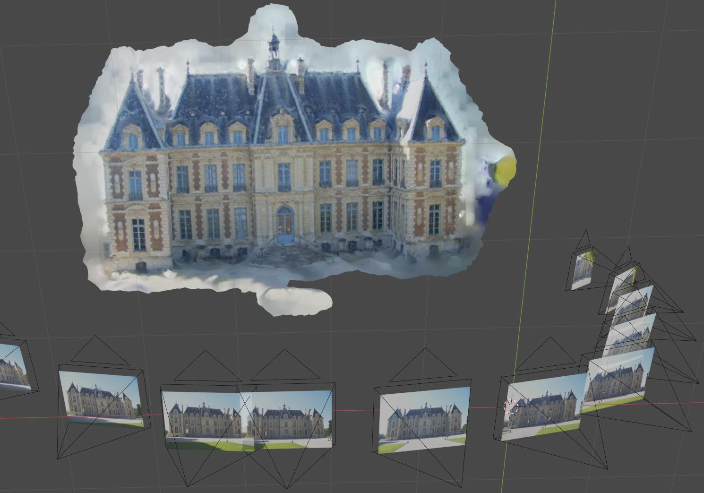
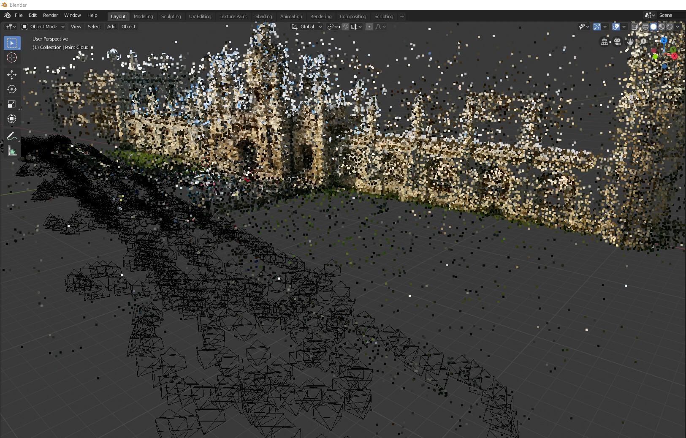

..
   Blender-Addon-Photgrammetry-Importer documentation master file, created by
   sphinx-quickstart on Sat Jun 20 18:28:02 2020.
   You can adapt this file completely to your liking, but it should at least
   contain the root `toctree` directive.

####################################
Blender-Addon-Photgrammetry-Importer 
####################################

.. 
   https://documentation-style-guide-sphinx.readthedocs.io/en/latest/style-guide.html
		Heading Levels (recommended order)
			# with overline
			* with overline
			=
			-
			^
			"
	There should be only one H1 in a document.

This documentation describes an `addon for Blender <https://github.com/SBCV/Blender-Addon-Photogrammetry-Importer>`_ that allows to import different reconstruction results of several :code:`Structure from Motion` and :code:`Multi-View Stereo` libraries.

Supported libraries (data formats):

.. hlist::
   :columns: 1

   - `Colmap <https://github.com/colmap/colmap>`_ (Model folders (BIN and TXT), workspaces, NVM, PLY) 
   - `Meshroom <https://alicevision.github.io/>`_ (MG, JSON, SfM, PLY)
   - `MVE <https://github.com/simonfuhrmann/mve>`_ (MVE workspaces) :sup:`1`
   - `Open3D <http://www.open3d.org/>`_ (JSON, LOG, PLY) :sup:`1`
   - `OpenSfM <https://github.com/mapillary/OpenSfM>`_ (JSON)
   - `OpenMVG <https://github.com/openMVG/openMVG>`_ (JSON, NVM, PLY) :sup:`2`
   - `Regard3D <https://www.regard3d.org/>`_ (OpenMVG JSON)
   - `VisualSFM <http://ccwu.me/vsfm/>`_ (NVM) :sup:`1`

In addition, the addon supports some common point cloud data formats:

.. hlist::
   :columns: 1

   - `Polygon files <http://paulbourke.net/dataformats/ply/>`_ (PLY) :sup:`3`
   - `Point Cloud Library files <https://github.com/PointCloudLibrary/pcl>`_ (PCD) :sup:`3`
   - `LASer files <https://www.asprs.org/divisions-committees/lidar-division/laser-las-file-format-exchange-activities>`_ (LAS) :sup:`3, 4`
   - `LASzip files <https://laszip.org/>`_ (LAZ) :sup:`3, 4, 5`
   - `Simple ASCII point files <https://www.cloudcompare.org/doc/wiki/index.php?title=FILE_I/O>`_ (ASC, PTS, CSV) :sup:`3`

| :sup:`1` Requires :code:`pillow` to read image sizes from disk. :sup:`2` Requires :code:`pillow` for point color computation.
| :sup:`3` Requires :code:`pyntcloud` for parsing. :sup:`4` Requires :code:`laspy` for parsing. :sup:`5` Requires :code:`lazrs` for parsing.

The latest release of the addon is currently compatible with Blender 3.1.2 onwards. 
For older Blender versions you might find a suitable release `here <https://github.com/SBCV/Blender-Addon-Photogrammetry-Importer/releases>`_.

Getting Started
===============

..
   Note:
   The API is automatically created with sphinx-autoapi (see conf.py).
   Add the "toctree" entry "autoapi/index" manually, in order to ensure that:
   - there will be a toc/navigation overview in the left toolbar.
   - the generated pages contain forward and backward buttons.
   This does not work, if the entry is automatically added by sphinx-autoapi.

.. 
   https://www.sphinx-doc.org/en/1.5/markup/toctree.html

.. toctree::
   :maxdepth: 1

   self
   installation
   troubleshooting
   customize
   examples
   import
   export
   adjustment
   alignment
   point_cloud
   python
   extension
   contribution
   documentation
   changelog
   autoapi/index

There is a short `tutorial video <https://www.youtube.com/watch?v=BwwaT2scoP0>`_ that shows how to

- install the addon
- compute a reconstruction with Meshroom
- import the results into Blender

Example Results (Shipped with Addon)
====================================
This repository contains an example Colmap model. The following image shows the imported camera poses, image planes and point cloud in Blender's 3D view.

.. image:: ../../images/import_result.jpg
   :scale: 32 %
   :align: center

The input images of the Colmap model are located here: https://github.com/openMVG/ImageDataset_SceauxCastle.

The addon computes an animated camera with corresponding background images from the reconstructed camera poses.

.. image:: ../../images/camera_animation_background.gif
   :scale: 33 %
   :align: center

There is also an import option that allows to interpolate the reconstructed camera poses.

In addition, the addon allows to import meshes contained in the workspaces of specific libraries. Manually imported meshes can also be aligned with the corresponding reconstruction by following the instructions :doc:`here <./import>`. 

The addon offers an option to draw big point clouds with OpenGL to reduce computational requirements. The addon provides a panel to export these OpenGL point clouds renderings - see :doc:`Point Cloud Visualization and Rendering <./point_cloud>`. 

..
	Indices and tables
	==================

	* :ref:`genindex`
	* :ref:`search`
