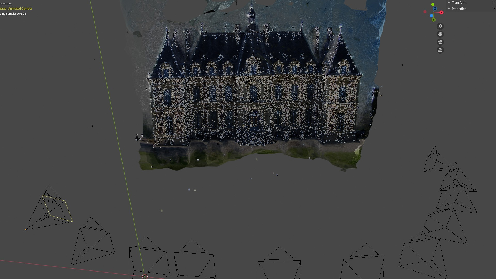

.. Blender-Addon-Photgrammetry-Importer documentation master file, created by
   sphinx-quickstart on Sat Jun 20 18:28:02 2020.
   You can adapt this file completely to your liking, but it should at least
   contain the root `toctree` directive.

####################################
Blender-Addon-Photgrammetry-Importer 
####################################

..  https://documentation-style-guide-sphinx.readthedocs.io/en/latest/style-guide.html
		Heading Levels (recommended order)
			# with overline
			* with overline
			=
			-
			^
			"
	There should be only one H1 in a document.

The repository of this documentation contains a Blender addon to import reconstruction results of several libraries.

Supported libraries / data formats:

- Colmap reconstructions (https://github.com/colmap/colmap) 
	* Colmap model folders (binary and txt format), Colmap workspaces, NVM, PLY 
- Meshroom reconstructions (https://alicevision.github.io/)
	* MG, JSON, SfM, PLY
- Multi-View Environment reconstructions (https://github.com/simonfuhrmann/mve)
	* MVE workspaces
- Open3D reconstructions (http://www.open3d.org/)
	* JSON, LOG, PLY
- OpenSfM reconstructions (https://github.com/mapillary/OpenSfM)
	* JSON
- OpenMVG reconstructions (https://github.com/openMVG/openMVG)
	* JSON, NVM, PLY
- Polygon Files (http://paulbourke.net/dataformats/ply/)
	* PLY
- Regard3D reconstructions (https://www.regard3d.org/)
	* (OpenMVG) JSON
- VisualSFM reconstructions (http://ccwu.me/vsfm/)
	* NVM
	

Tested for Blender 2.81. There is an older version of the addon available for Blender 2.79 that allows to import NVM files - see the `2.79 branch <https://github.com/SBCV/Blender-Import-NVM-Addon/tree/blender279>`_.

Getting Started
===============

.. https://www.sphinx-doc.org/en/1.5/markup/toctree.html
.. toctree::
   :maxdepth: 1

   self
   installation
   troubleshooting
   customize
   examples
   import
   export
   adjustment
   alignment
   point_cloud
   python
   contribution
   changelog

There is a short `tutorial video <https://www.youtube.com/watch?v=BwwaT2scoP0>`_ that shows how to

- install the addon
- compute a reconstruction with Meshroom
- import the results into Blender

Example Results (Shipped with Addon)
====================================
This repository contains an example NVM file. The imported result looks as follows.

.. image:: ../../images/import_result.jpg
   :scale: 32 %
   :align: center

The input images of the NVM file are located here: https://github.com/openMVG/ImageDataset_SceauxCastle.

There is an import option that interpolates the reconstructed camera poses to compute a camera animation.

.. image:: ../../images/camera_animation.gif
   :scale: 22 %
   :align: center

You can also overlay the (sparse) point cloud with the corresponding mesh - see :doc:`Import Data <./import>`. 

The addon offers an option to draw big point clouds with OpenGL to reduce computational requirements. The addon provides a panel to export these OpenGL point clouds renderings - see :doc:`Point Cloud Visualization and Rendering <./point_cloud>`. 

.. image:: ../../images/import_result_opengl.jpg
   :scale: 40 %
   :align: center

..
	Indices and tables
	==================

	* :ref:`genindex`
	* :ref:`search`
