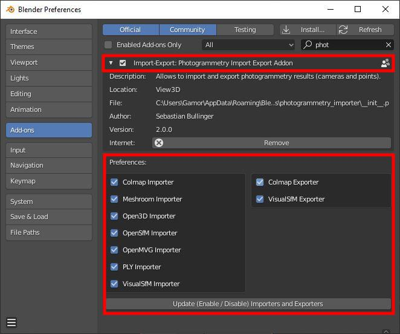

*************************
Installation Instructions
*************************
Delete any previous version of the addon. See the :doc:`troubleshooting page <./troubleshooting>` for more information. Otherwise errors may appear during activation or Blender may not reflect the latest changes of the addon. 

Clone the addon for Blender 2.80 (or newer): ::

	git clone https://github.com/SBCV/Blender-Addon-Photogrammetry-Importer.git

Compress the folder :code:`photogrammetry_importer` in :code:`Blender-Addon-Photogrammetry-Importer` to a zip archive. 
The final structure must look as follows:

::

	photogrammetry_importer.zip /
	    photogrammetry_importer /
	        ext
	        file_handler
	        blender_utils.py
	        ...

Install the addon by 
	- Opening the preferences of Blender (:code:`Edit / Preferences ...`)  
	- Select :code:`Add-ons` in the left toolbar
	- Click on :code:`Install...` in the top toolbar
	- Navigate to the :code:`photogrammetry_importer.zip` file, select it and click on :code:`Install Add-on` 
	- Scroll down to **ACTIVATE the addon**, i.e. check the bounding box left of :code:`Import-Export: Photogrammetry Import Export Addon` (see image below)

.. image:: ../../images/activated.jpg
   :scale: 75 %
   :align: center

If you want to only add a subset of the provided import/export functions, adjust the checkboxes in the addon preferences and click on  the :code:`Update (Enable/Disable) Importers and Exporters` button as shown below:

Optional Dependency for VisualSfM and OpenMVG/Regard3D Files
============================================================
This addon uses `Pillow <https://pypi.org/project/Pillow/>`_ to compute missing information for VisualSFM (NVM) and OpenMVG (JSON) files.

- For VisualSFM (NVM) the addon uses pillow to read the (missing) image sizes from disc.
- For OpenMVG/Regard3D (JSON) the addon uses pillow to compute the (missing) colors for the 3D points in the point cloud.

Using Pillow instead of Blender's image API significantly improves processing time. 

If you haven't installed `pip <https://pypi.org/project/pip/>`_ for Blender already, download https://bootstrap.pypa.io/get-pip.py and copy the file to ::

<Blender_Root>/<Version>/python/bin

For Linux run: ::

<Blender_Root>/<Version>/python/bin/python3.7m <Blender_Root>/<Version>/python/bin/get-pip.py
<Blender_Root>/<Version>/python/bin/pip install pillow

For Windows run: ::

<Blender_Root>/<Version>/python/bin/python.exe <Blender_Root>/<Version>/python/bin/get-pip.py
<Blender_Root>/<Version>/python/Scripts/pip.exe install pillow

IMPORTANT: Use the full path to the python and the pip executable. Otherwise the system python installation or the system pip executable may be used.
