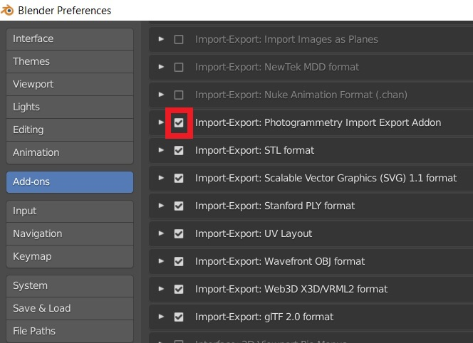
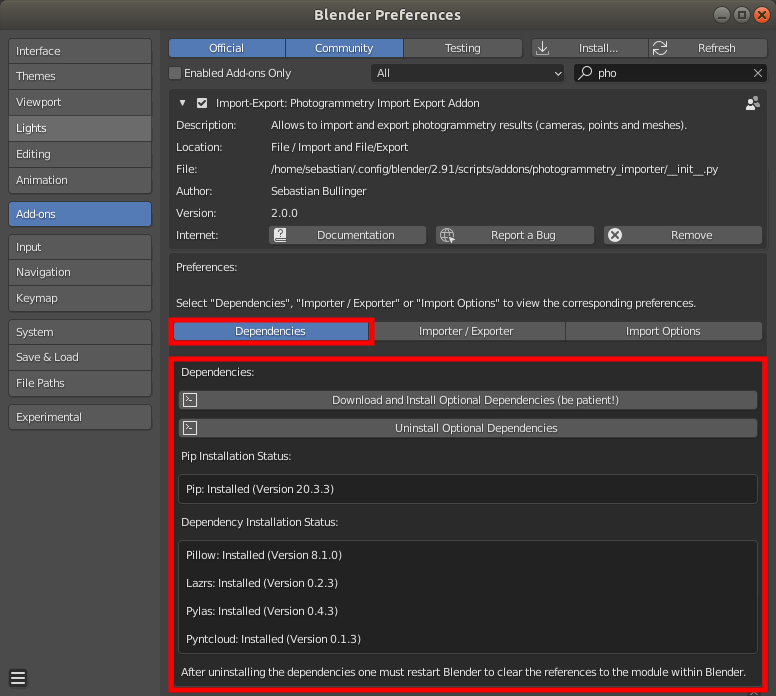

*************************
Installation Instructions
*************************

Delete any Previous Version of the Addon
========================================

- Remove any previous version of the addon from Blender.
    * Inside Blender go to :code:`Edit/Preferences/Add-ons`, search for :code:`Import-Export: Photogrammetry Import Export Addon` and click on :code:`Remove`
    * See the :doc:`troubleshooting page <./troubleshooting>` for more information.
- **THEN, CLOSE BLENDER**
- Reopen Blender and follow the installation instructions below

Without removal of previous versions errors may appear during activation or Blender may not reflect the latest changes of the addon. 

Download the Addon for Blender 2.80 (or newer)
==============================================

Option 1: Download a Release Version of the Addon
-------------------------------------------------
Download the corresponding :code:`photogrammetry_importer.zip` from the `release page <https://github.com/SBCV/Blender-Addon-Photogrammetry-Importer/releases>`_.

Option 2: Download the Latest Version of the Addon
--------------------------------------------------

For example, clone the addon with ::

	git clone https://github.com/SBCV/Blender-Addon-Photogrammetry-Importer.git

(Alternatively, go to :code:`https://github.com/SBCV/Blender-Addon-Photogrammetry-Importer`, click on :code:`clone or download`, and download the archive by clicking on :code:`Download Zip`. Extract the :code:`Blender-Addon-Photogrammetry-Importer-master.zip` file, which creates a folder :code:`Blender-Addon-Photogrammetry-Importer`.) 

Finally, compress the folder :code:`photogrammetry_importer` in :code:`Blender-Addon-Photogrammetry-Importer` to a zip archive :code:`photogrammetry_importer.zip`. 
The final structure must look as follows:

::

	photogrammetry_importer.zip /
	    photogrammetry_importer /
	        blender_utility
	        ext
	        file_handler
	        ...
	        __init__.py

For convenience the repository contains a script (:code:`create_blender_addon_zip.sh` for Linux, :code:`create_blender_addon_zip.bat` for Windows) that creates the required :code:`photogrammetry_importer.zip` file. Run the script without parameters (e.g. :code:`./create_blender_addon_zip.sh`).

Install the Addon
=================

Install the addon by 
	- Opening the preferences of Blender (:code:`Edit / Preferences ...`)  
	- Select :code:`Add-ons` in the left toolbar
	- Click on :code:`Install...` in the top toolbar
	- Navigate to the :code:`photogrammetry_importer.zip` file, select it and click on :code:`Install Add-on` 
	- Scroll down to **ACTIVATE the addon**, i.e. check the bounding box left of :code:`Import-Export: Photogrammetry Import Export Addon` (see image below)

Follow the instructions on the :doc:`customize <./customize>` page, to adjust the default options of the addon. 

Install Optional Dependencies
=============================

This addon uses `Pillow <https://pypi.org/project/Pillow/>`_ to read the (missing) image sizes from disk - required by the MVE, the Open3D and the VisualSFM importer. Pillow is also used to compute the (missing) point colors for OpenMVG JSON files. Using Pillow instead of Blender's image API significantly improves processing time. Furthermore, this addon uses `Pyntcloud <https://pypi.org/project/pyntcloud/>`_ to import several point cloud formats such as :code:`.ply`, :code:`.pcd`, :code:`.las`, :code:`.laz`, :code:`.asc`, :code:`.pts` and :code:`.csv`. For parsing :code:`.las` and :code:`.laz` files `Laspy 2.0 (or newer) <https://github.com/laspy/laspy/>`_, `Lazrs <https://pypi.org/project/lazrs/>`_ and :code:`Pyntcloud 0.3` (or newer) is required.

Option 1: Installation using the GUI (recommended)
--------------------------------------------------

Requires Blender 2.83.5 or newer. **Administrator privileges might be required to install the dependencies (dependending on the location of the Blender installation directory).**

Clicking on :code:`Download and Install Optional Dependencies` installs :code:`pip` (if not already present) and uses the :code:`pip` executable to install the actual dependencies.
Start :code:`Blender` from the command line to see the installation progress and potential error messages.

Note: If you experience problems while *updating* the dependencies, try a fresh Blender installation.

Note: If you use `VSCode <https://code.visualstudio.com/>`_ with `Blender VSCode <https://github.com/JacquesLucke/blender_vscode>`_ to run this addon, the installation of laspy will fail. In this case you need to install it manually (see below).

Option 2: Installation using the command line
---------------------------------------------

In case the installation using the GUI does not work, it is possible to install the dependencies with the command line.

If you haven't installed `pip <https://pypi.org/project/pip/>`_ for Blender already, download https://bootstrap.pypa.io/get-pip.py and copy the file to ::

<Blender_Root>/<Version>/python/bin

For Linux run: ::

<Blender_Root>/<Version>/python/bin/python3.7m <Blender_Root>/<Version>/python/bin/get-pip.py
<Blender_Root>/<Version>/python/bin/pip install pillow
<Blender_Root>/<Version>/python/bin/pip install lazrs
<Blender_Root>/<Version>/python/bin/pip install laspy
<Blender_Root>/<Version>/python/bin/pip install pyntcloud

For Windows run: ::

<Blender_Root>/<Version>/python/bin/python.exe <Blender_Root>/<Version>/python/bin/get-pip.py
<Blender_Root>/<Version>/python/Scripts/pip.exe install pillow
<Blender_Root>/<Version>/python/Scripts/pip.exe install lazrs
<Blender_Root>/<Version>/python/Scripts/pip.exe install laspy
<Blender_Root>/<Version>/python/Scripts/pip.exe install pyntcloud

IMPORTANT: Use the full path to the python and the pip executable. Otherwise the system python installation or the system pip executable may be used.
