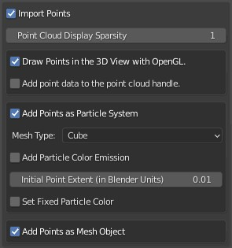
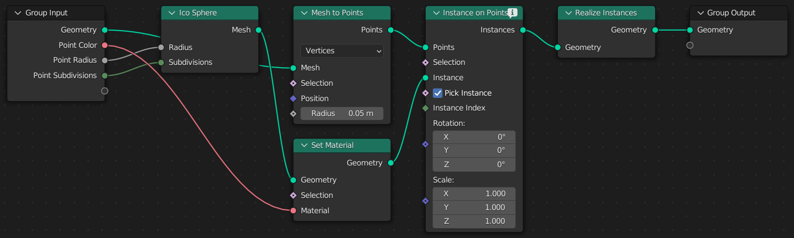
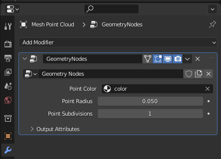
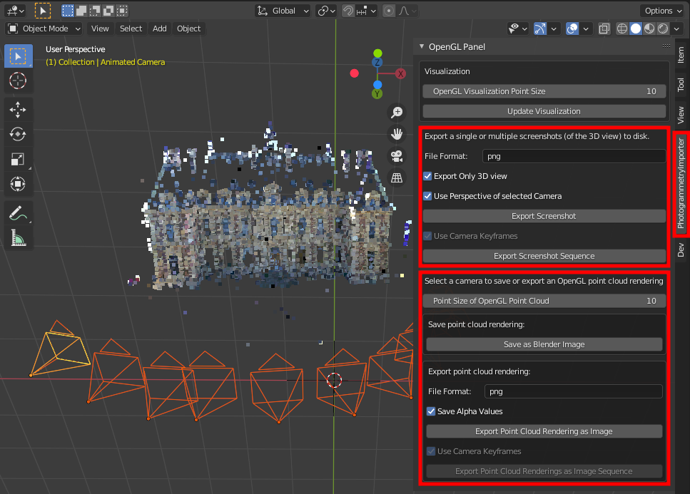
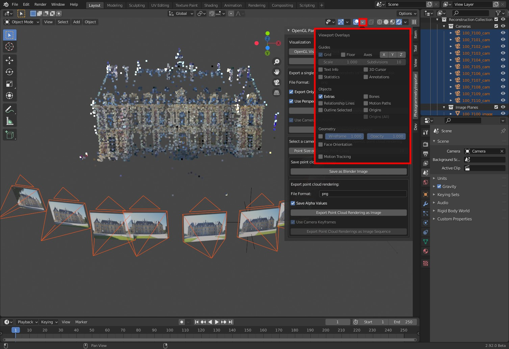
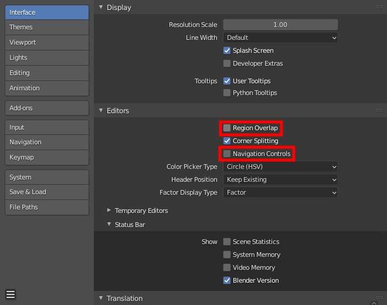
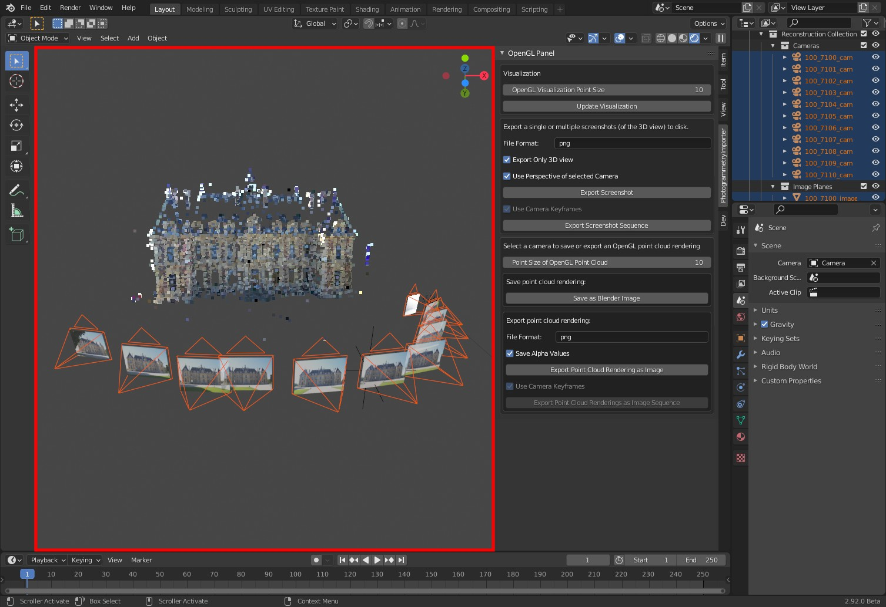

***************************
Visualization and Rendering
***************************

Currently, this addon supports the following two point cloud visualization options:

* Representing the points with a mesh object (using Blender's Geometry Nodes)
* Visualizing the points with OpenGL

Each option has different advantages / disadvantages.

Option 1: Representing the Points with a Mesh Object (using Blender's Geometry Nodes)
=====================================================================================

If selected, the addon adds a blender object with a vertex for each point in the point cloud. The option :code:`Add Geometry Nodes` create several geometry nodes (see image below) that allow to render the point cloud with Eevee or Cycles.

The :code:`point radius` and the :code:`point subdivision` can be adjusted after import using the :code:`Properties editor` (:code:`Shift + F7`).

Option 2: Visualizing and rendering the points with OpenGL
==========================================================

If selected, the point cloud is shown in the Viewport using Blender's OpenGL API. That means, there is **no** Blender object representing the points in the point cloud. The pose (i.e. rotation and translation) of the object can be changed by adjusting the corresponding "anchor" (i.e. a Blender :code:`empty` object).

* Advantage: Low computational costs for visualization.
* Disadvantage: It is not possible to render these points with the render functions provided by Blender. However, this addon provides a panel to save/export OpenGL renderings of the points using an offscreen buffer or Blender's screenshot operator (see image below).

Option 2a: Write results to disk with Blender's offscreen buffer 
----------------------------------------------------------------

Rendering the scene with Blender's offscreen buffer renders (only!) the points drawn with Blender's OpenGL API to disk. In order to render other elements such as cameras, image planes, meshes etc use Blender's screenshot operator - see below.

Option 2b: Write results to disk with Blender's screenshot operator 
-------------------------------------------------------------------

Since Blender's screenshot operator renders all visible elements of the viewport to disk it is usually convenient to adjust the appearance.

In order to hide gridlines, axes etc. click on the :code:`Overlays` button in Blenders 3D viewport and disable the corresponding options - see the image below.

To ensure that the reconstruction results are not occluded by Blender panels go to :code:`Edit / Preferences ...` and uncheck the option :code:`Region Overlap` - as shown in the following image. There, it is also possible to hide the :code:`Navigation Controls`.

After adjusting these options the viewport looks as follows.

